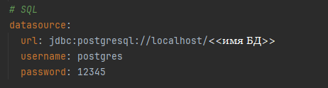

# [Курс по Rest API](https://sites.google.com/iteratia.com/java-test-titanic/) от Nerzon   

**<details><summary>Запросы</summary>**

```java
Cat:

        {
        "id":

integer($int32),
        "name":string,
        "age":

integer($int32),
        "weight":

integer($int32)
        }
```

```java
CatDTO:

        {
        "name":string,
        "age":

integer($int32),
        "weight":

integer($int32)
        }
```

```java
Главная страница

http://localhost:8080/api
```

**`GET`**
> **/api/all** - возвращает всех котов

> **/api** - возвращает кота по id

**`POST`**
> **/api/add** - создает кота

**`PUT`**
> **/api** - изменяет данные кота

**`DELETE`**
> **/api** - удаляет кота по id

</details>

**<details><summary>Запуск приложения</summary>**

- Открыть приложение через Idea.

- Прикрепить БД к нашему приложению:
    - Создать в PostgreSql БД <<имя бд>>.
    - Поменять параметры в application.yml:

<p align="center"></p>
- Запустить `CourseApplication.java.`

</details>

**<details><summary>Примечания</summary>**

- Swagger
    - Открыть Swagger UI можно по [ссылке](https://sites.google.com/iteratia.com/java-test-titanic/).
    - Действия **try in out** происходят внутри реальной бд.

</details>

**<details><summary>Состав курса</summary>**

- [X] **Лекция №1** - Вводная

- [X] **Лекция №2** - Интегрируем PostgreSQL в REST приложение на Java

- [X] **Лекция №3** - Документация REST API при помощи Swagger | Немного про DTO

- [ ] **Лекция №4** - Складываем REST приложение в контейнер | Docker | Docker Compose

- [ ] **Лекция №5** - Общение микросервисов между собой | Java | Kafka на практике

- [ ] **Лекция №6** - Гайд по интеграции mongoDB в Spring Boot приложение | REST API на Java

- [ ] **Лекция №7** - Легкая настройка SECURITY в REST API | Протокол OAuth 2 | Keycloak SpringBoot 3

- [ ] **Лекция №8** - Unit и Integration тестирование REST API | Spring Framework | Основы

- [ ] **Лекция №9** - Используем Spring для Отправки Email

- [ ] **Лекция №10** - Миграции баз данных с Flyway и Liquibase | Spring Boot | Java

- [ ] **Лекция №11** - HTTP протокол и все о нём | HTTPS, SSL, TLSl

- [ ] **Лекция №12** - Брокер сообщений RabbitMQ | Java Spring Boot

</details>

**Стек технологий**

Java 21, Spring JPA, Maven, PostgresSQL, Lombok, Swagger.